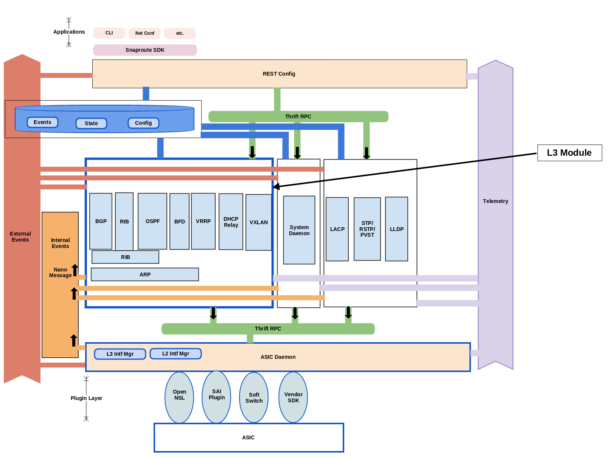

# SnapRoute Layer 3 Protocol Stack

http://www.snaproute.com

Complete product documentation is available at
[Product Overview] (http://opensnaproute.github.io/docs/)

Complete system architecture can be found
[Here](http://opensnaproute.github.io/docs/architecture.html)

## Synopsis
This repository holds source code and tests for various the layer 3 protocols and the infrastructure code for layer 3 protocols provided by SnapRoute.
Currently it has following protocols and infrastructure modules:
 - [Address Resolution Protocol](arp/ "ARP")
 - [Bi-directional Forwarding Detection](bfd/ "BFD")
 - [Border Gateway Protocol](bgp/ "BGP")
 - [Dynamic Host Configuration Protocol Relay](dhcp_relay/ "DHCP Relay Agent")
 - [Dynamic Host Configuration Protocol](dhcp/ "DHCP Agent")
 - [Open Shortest Path First](ospf/ "OSPF")
 - [Routing Information Base](rib/ "RIB Daemon")
 - [Tunneling Protocols](tunnel/ "Tunneling")
 - [Virtual Router Redundancy Protocol](vrrp/ "VRRP")
