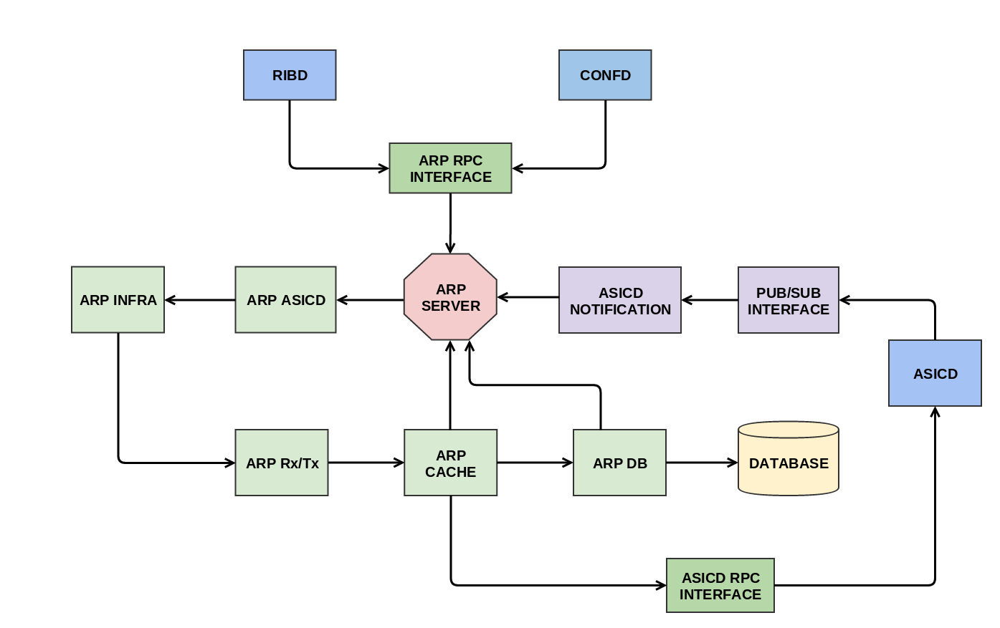

# Address Resolution Protocol

### Introduction
The address resolution protocol (arp) is a protocol used by the Internet Protocol (IP) [RFC826], specifically IPv4, to map IP network addresses to the hardware addresses used by a data link protocol. The protocol operates below the network layer as a part of the interface between the OSI network and OSI link layer.

### Architecture

### Description

ARP module listens to ASICD notification for L3 interface creation/deletion. It starts Rx/Tx go routines on all L3 interface.

- When it receives any ARP request, ARP cache is updated with IP Address (source IP) to Mac Address (source MAC) in ARP request packet. Linux ARP stack replies to the ARP Request.

- When it receives any ARP reply, ARP cache is updated with IP Address (destination IP) to Mac Address (destination MAC) in the ARP reply packet.

- When it receives any IPv4 packet, ARP cache is updated with IP Address (source IP) to Mac Address (source MAC) in the IPv4 packet if source IP is in local subnet of the switch's L3 interface. And ARP module sends an ARP request packet for the destination IP address.

- When RIB module receives a route, RIB daemon sends ARP daemon a message to resolve IP Address to Mac Address mapping for the nexthop IP Address.

### Interfaces
Configutation Object Name: **ArpGlobal**

> - Create ARP Global Config:

		bool CreateArpGlobal(1: ArpGlobal config);

>  - Update ARP Gloabl Config:

		bool UpdateArpGlobal(1: ArpGlobal origconfig, 2: ArpGlobal newconfig, 3: list<bool> attrset);

>  - Delete ARP Global Config:

		bool DeleteArpGlobal(1: ArpGlobal config);

State Object Name: **ArpEntryState**, **ArpLinuxEntryState**

>  - Get the list of ARP Entries (Object Name: ArpEntryState):

		ArpEntryStateGetInfo GetBulkArpEntryState(1: int fromIndex, 2: int count);

>  - Get the ARP Entry corresponding to given IP Address:

		ArpEntryState GetArpEntryState(1: string IpAddr);

>  - Get the list of linux ARP Entries (Object Name: ArpLinuxEntryState):

		ArpLinuxEntryStateGetInfo GetBulkArpLinuxEntryState(1: int fromIndex, 2: int count);

>  - Get the linux ARP Entry corresponding to given IP Address:

		ArpLinuxEntryState GetArpLinuxEntryState(1: string IpAddr);

Actions:

> - Delete all the ARP entries learnt on given interface name

		bool ExecuteActionArpDeleteByIfName(1: ArpDeleteByIfName config);

> - Delete the ARP entry corresponding to given IPv4 address

		bool ExecuteActionArpDeleteByIPv4Addr(1: ArpDeleteByIPv4Addr config);

Note: We can only delete Arp entries which are not the nexthop for any of the routes.

> - Refresh all the ARP entries learnt on given interface name

		bool ExecuteActionArpRefreshByIfName(1: ArpRefreshByIfName config);

> - Refresh the ARP entry corresponding to given IPv4 address

		bool ExecuteActionArpRefreshByIPv4Addr(1: ArpRefreshByIPv4Addr config);
