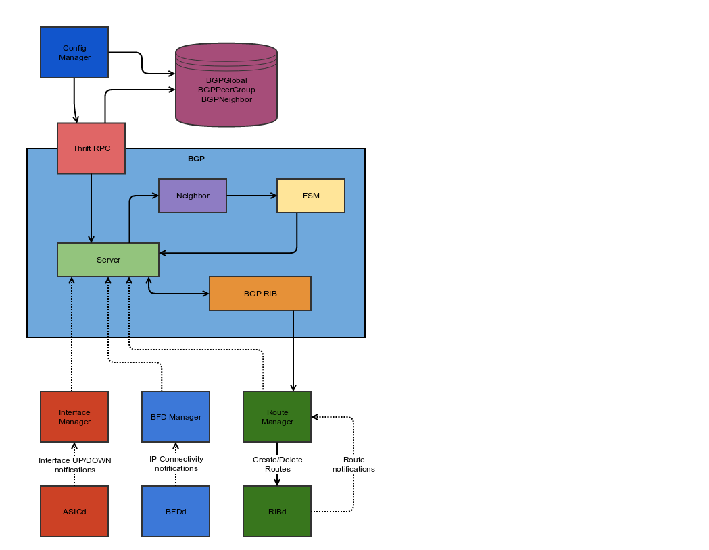

# Border Gateway Protocol

### Introduction

This is a implementation of Border Gateway Protocol (BGP-4) in Go.

The following RFCs have been implemented with plan to add more:

    1. RFC-4271: Base BGP-4 RFC
    2. RFC-4456: Route reflector
    3. RFC-5492: Capabilities
    4. RFC-4893: Four-octet AS Numbers
    5. RFC-4760: Multiprotocol Extensions
    6. https://tools.ietf.org/html/draft-ietf-idr-add-paths-14: Advertisement of Multiple Paths in BGP

### Architecture

### Interfaces
Exposed Interfaces

### Configuration
Location of configuration and expected entries in configuration file
