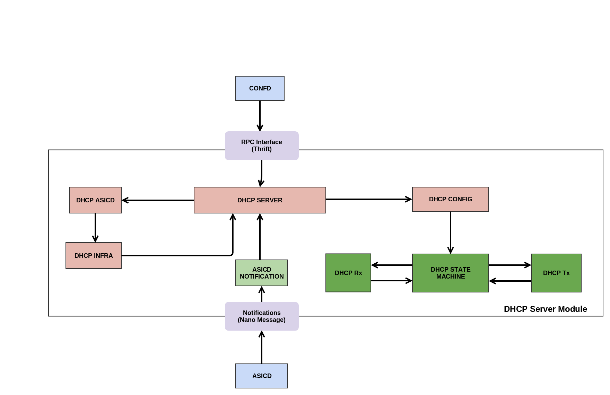

# Dynamic Host Configuration Protocol

### Introduction
Dynamic Host Configuration Protocol (DHCP) is a client/server protocol that automatically provides an Internet Protocol (IP) host with its IP address and other related configuration information such as the subnet mask and default gateway.

### Architecture

### Interfaces
Configuration Object Name: **DhcpGlobalConfig**

		struct DhcpGlobalConfig {
			1 : string DhcpConfigKey
			2 : bool Enable
			3 : i32 DefaultLeaseTime
			4 : i32 MaxLeaseTime
		}

> - Create Dhcp global configuration:

		bool CreateDhcpGlobalConfig(1: DhcpGlobalConfig config);

> - Update Dhcp global configuration:

		bool UpdateDhcpGlobalConfig(1: DhcpGlobalConfig origconfig, 2: DhcpGlobalConfig newconfig, 3: list<bool> attrset);

> - Delete Dhcp global configuration:

		bool DeleteDhcpGlobalConfig(1: DhcpGlobalConfig config);

Configuration Object Name: **DhcpIntfConfig**

		struct DhcpIntfConfig {
			1 : string IntfRef
			2 : string Subnet
			3 : string SubnetMask
			4 : string IPAddrRange
			5 : string BroadcastAddr
			6 : string RouterAddr
			7 : string DNSServerAddr
			8 : string DomainName
			9 : bool Enable
		}

> - Create Dhcp interface configuration:

		bool CreateDhcpIntfConfig(1: DhcpIntfConfig config);

> - Update Dhcp interface configuration:

		bool UpdateDhcpIntfConfig(1: DhcpIntfConfig origconfig, 2: DhcpIntfConfig newconfig, 3: list<bool> attrset);

> - Delete Dhcp interface configuration:

		bool DeleteDhcpIntfConfig(1: DhcpIntfConfig config);
