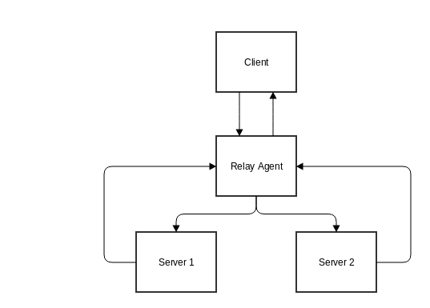

# Dynamic Host Configuration Protocol Relay

### Introduction
This module implements Dynamic Host Configuration Protocol Relay Agent. The protocol is standalone Process Daemon, with
current dependencies with a configuration daemon CONFD and programability of HW Asic and/or Linux Kernel via ASICD

The Relay Agent will have an instance running per interface.

### Architecture

### Interfaces
Dhcp Relay Agent is a standalone protocol daemon with configuration dependant to configuration daemon CONFD
#####IPC
    Dhcp Relay Agent will recieve configuration data from CONFD via Thrift RPC
    Dhcp Relay Agent will also send statistics/state to the user via Thrift RPC
#####Events
    1. Link UP/DOWN events from ASICD via Nano-Msg
    2. IPv4 Interface Create/Delete from ASICD via Nano-Msg
    3. Vlan Create/Delete from ASICD via Nano-Msg
#####Packet Rx/Tx
    1. Server -> Relay Agent -> Client, we will use GoPacket
    2. Client -> Relay Agent -> Server, we will write to UDP directly using golang net interface package

#####Dhcp Relay has following state:
  1. Receive DISCOVER Packet
  2. Relay client Packet to all servers (configured) updating Relay Agent Information in Dhcp Options
  3. Receive OFFER Packet
  4. Send Unicast OFFER to Client (if configured) else Broadcast OFFER Packet
  5. Receive REQUEST Packet
  6. Relay REQUEST Packet to Server
  7. Receive ACK Packet
  8. Relay ACK Packet to Client

### Configuration
 Detailed information for the object can be found in [models package](https://github.com/SnapRoute/models/blob/master/dhcprelayObjects.go)
 The objects are created keeping in mind the basic Relay Agent Design.
 - Global Config to enable/disable Relay Agent across all interfaces
 - Create/Delete Relay Agent per interface
 - Configure Server's for Relay Agent
