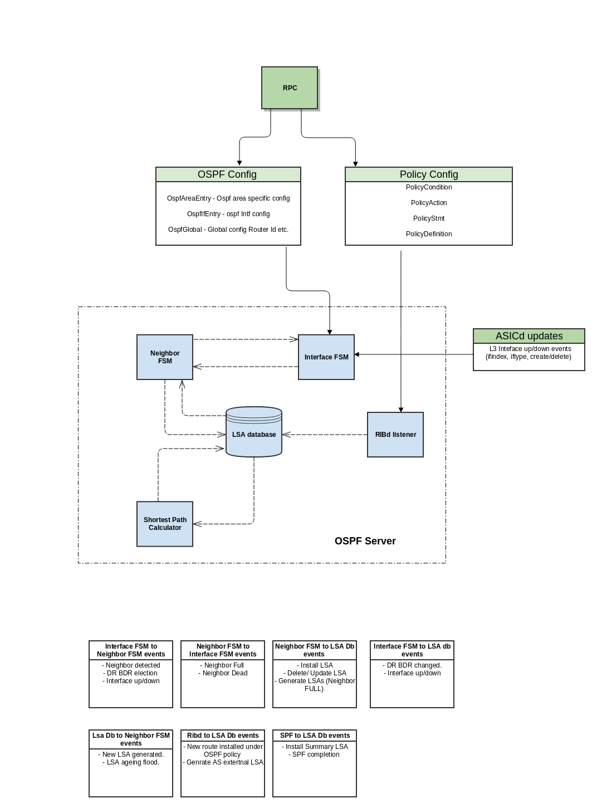

# Open Shortest Path First

### Introduction
This module implements Open Shortest Path First.v2
RFC 2328

### Architecture

### Modules
OSPF has below components
1) Interface FSM -
Handles per interfce OSPF config events,send hello packets, DR/BDR election .
 It signals Neighbor FSM whenenever new neighbor is detected.

2) Neighbor FSM -
This component implements
RX packets such as DB description , LSA Update/Request/Ack.
Takes care of flooding.
Inform LSDB for different events such as neighbor full, install LSA.

3) LSDB -
LSA database. Stores 5 types of LSAs.
Trigger SPF when new LSA is installed .
Generate router/networks LSAs for neighbor full event.
Generate summary LSA if ABR.
Generate AS external if ASBR.
Implements LSA ageing.
Inform Neighbor FSM for flooding  when new LSA is installed.

4)SPF -
Takes care of shortest path calculation and install routes.
Signal LSDB to generate summary LSA when ABR.

5) RIBd listener -
Listens to RIBd updates when OSPF policy is configured.
When router is acting as ASBR - RIbd listener will receive route updates as per the
policy statement.
It signals LSDB for AS external generation when router is configured as ASBR.

### Configuration
Current OSPF configuration is as per OSPF-MIB.yang file
