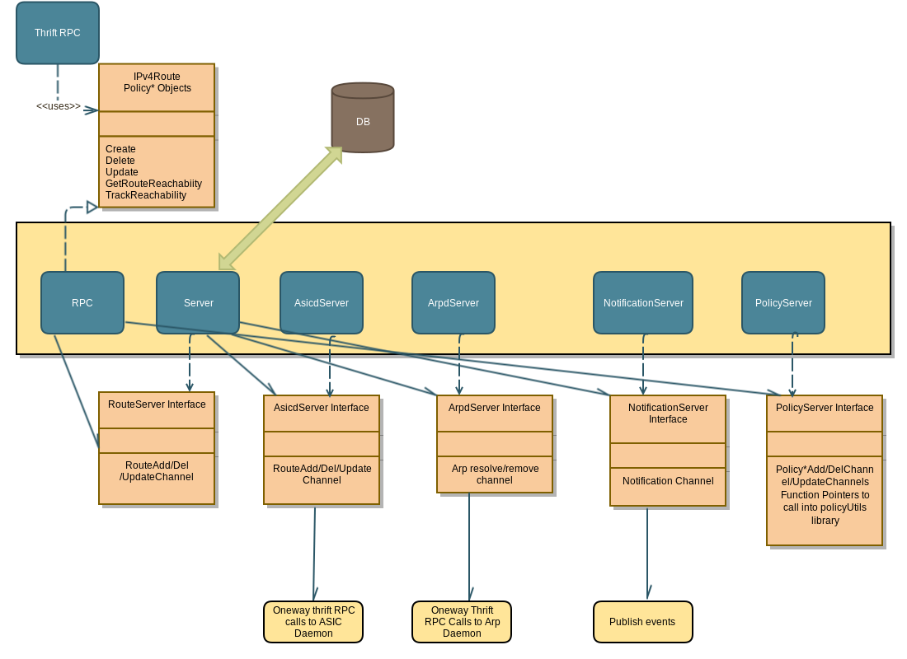

# Routing Information Base

### Introduction
This is a implementation of Routing Information Base (RIB) in Go.
Summary of functionality implemented by this module is as follows:

1. Handle all network route based configuration (route create, route delete, route update) from either users or other applications (e.g., BGP, OSPF)

2. Handle all routing policy based configuration :
   a. policy conditions create/delete/updates
   b. policy statements create/delete/updates
   c. policy definitions create/delete/updates

3. Implement policy engine
   a. Based on the policy objects configured and applied on the device, the policy engine filter will match on the conditions provisioned and implement actions based on the application location.
For instance, the policy engine filter may result in redistributing certain (route type based/ network prefix based) routes into other applications (BGP,OSPF, etc.,)
4. Responsible for calling ASICd thrift APIs to program the routes in the FIB.

### Architecture

### Interfaces
Exposed Interfaces

### Configuration
Location of configuration and expected entries in configuration file
